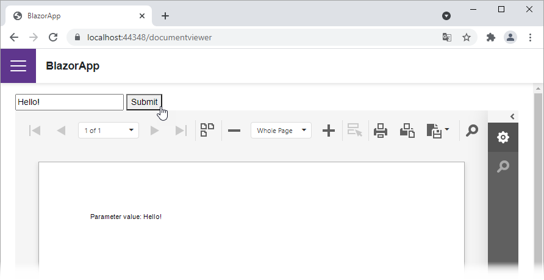

<!-- default badges list -->

<!-- default badges end -->
# Reporting for Blazor (JavaScript-Based Document Viewer) - Specify Parameter Values

This example demonstrates how to submit parameter values on a button click.

## How to Run the Example

1. Download the project and update NuGet packages.
2. Build and run the project.
3. Navigate a the page that contains the document viewer.
4. Enter a parameter value in the editor and click the *Submit* button.

## Files to Review

* [DocumentViewer.razor](CS/BlazorApp/Pages/DocumentViewer.razor)
* Report name resolution services:
	- [CustomReportProvider.cs](CS/BlazorApp/Services/CustomReportProvider.cs) (default)
	- [CustomReportStorageWebExtension.cs](CS/BlazorApp/Services/CustomReportStorageWebExtension.cs#L47)
## Documentation

* [Create a Blazor Reporting (JavaScript-Based) Application](https://docs.devexpress.com/XtraReports/401677)
* [Specify Parameter Values in a Blazor Reporting (JavaScript-Based) Application](https://docs.devexpress.com/XtraReports/403243)
<!-- feedback -->
## Does this example address your development requirements/objectives?

 

(you will be redirected to DevExpress.com to submit your response)
<!-- feedback end -->
